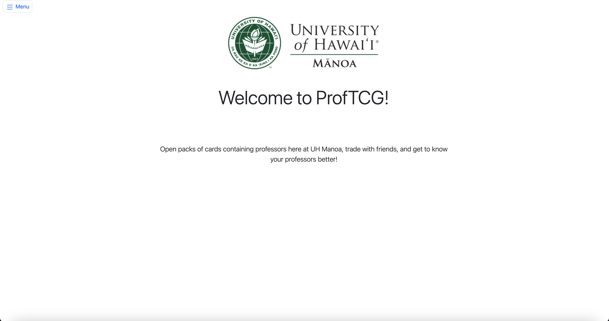
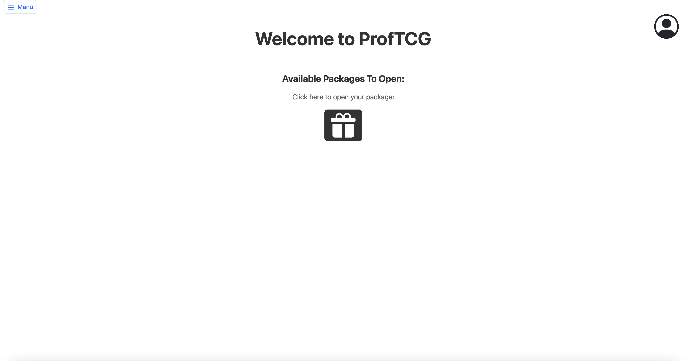
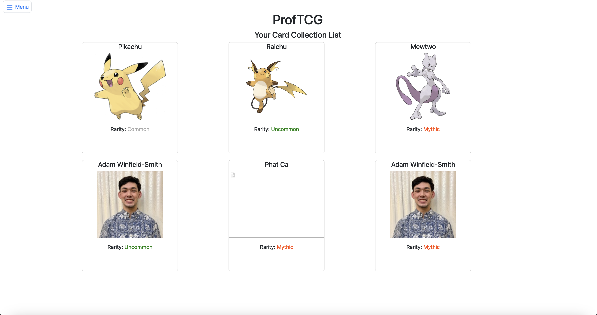
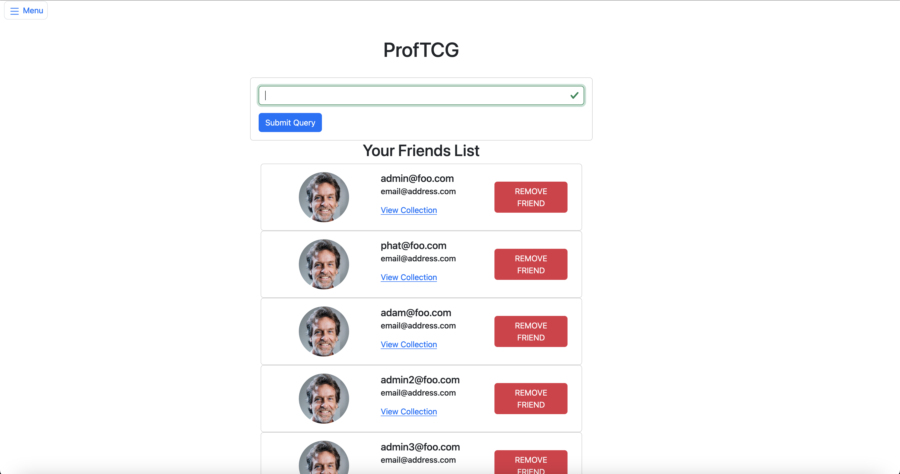
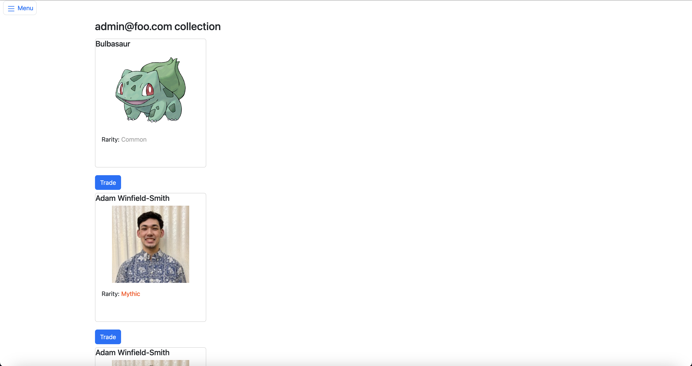
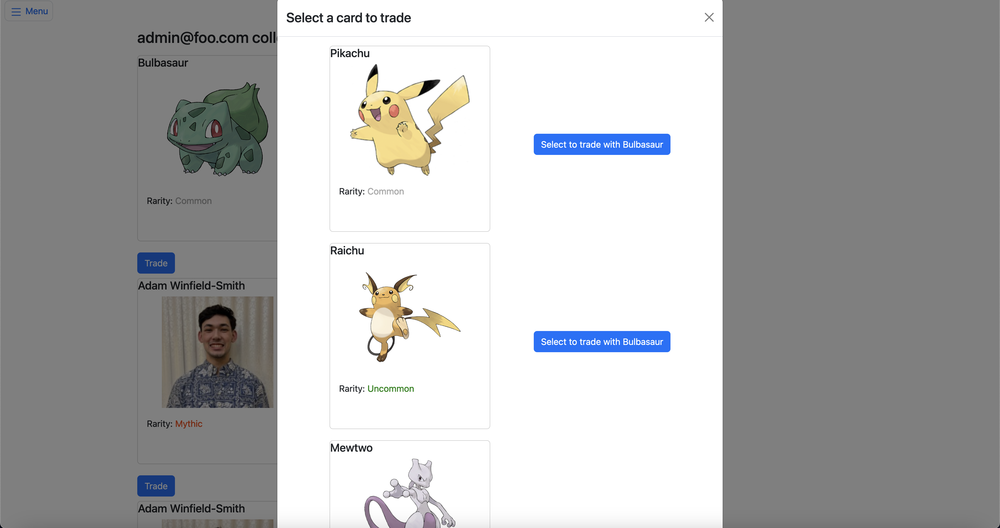
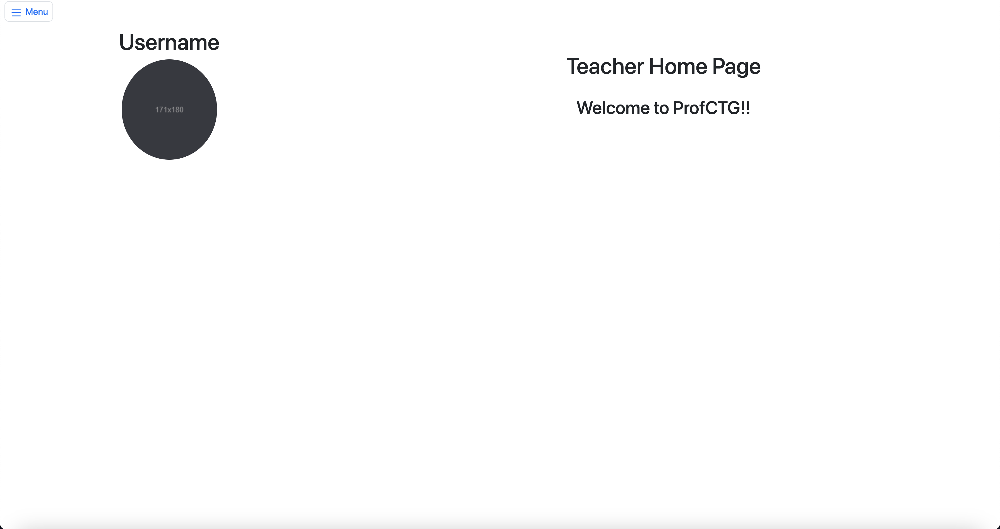

# ProfTCG: Professor Trading Card Game

## Overview

Our project aims to incorporate the popularity of trading card games with our local community to help students build connections with each other and their professors.

* [Meteor](https://www.meteor.com/) for Javascript-based client and server code implementation.
* [React](https://reactjs.org/) for component-based UI implementation and routing.
* [React Bootstrap](https://react-bootstrap.github.io/) CSS Framework for UI design.

## Our Vision

* Facilitate student-to-student card trading
* Students will receive packs of cards at the start of each semester, featuring professors from UH Manoa at random
* Introduce a rarity system, adding excitement with elusive cards
* Establish a trading hub for seamless exchanges between students
* Empower professors to gift special cards as incentives for academic excellence

## User Guide 

### Add friends
Add friends through the add friend page and view others collections. Add your friend through their username and be able to offer trades with your friends.


### Open Packs
Open your pack through the home page, click the present and if there are cards available to you, the cards will be added to your collection

![]

## Developer Guide 

* First, Install [Meteor](https://docs.meteor.com/install.html)
* Second, Visit our [Repository](https://github.com/academic-flow/professor-trading-card) and create a copy
* Next, change directories into the app directory by running 
```$ cd app```
* Now, install the necessary libraries by running `$ meteor npm install`
* Lastly, run `$ meteor npm run start`
* After this step, the site should be up and running at http://localhost:3000/


## User Guide 

### Landing Page

Users will be routed to this page when they hit the URL




### Home/Main Page

The home/main page is what users will see right after they log in. There will be information about pending requests for card trading, and the amount of card 
packages they currently have. Users will be able to open the package on this page and accept or deny the trading request



### Your card collection

This is where users can see what card they currently have. Listing out all the cards and they can click on it to view more information about the card



### Friends list page

This page is designed for users to manage their friend list. By clicking on a friend's profile, users can view the cards owned by that friend and initiate trade requests directly from there. Additionally, users have the flexibility to add new friends or remove existing ones by simply entering their username.



### Viewing a friend's collection from their page

This page showcases your friend's collection and also lets you send them an offer to trade for their card.




### Trade Model 

Upon clicking trade while viewing your friend's collection, you will be shown your personal collection and can choose what you would like to offer for a trade.



### Sign In Page and Register

These pages allow users to sign into their accounts as well as register for them. Admin roles are given through a key provided to professors which allow them admin privileges and the ability to create cards and add them to users collections.


### Teacher Home Page 

This page is only available to those with admin privileges and is what the teachers will see for their home page. 



### Team

Team members:
* [Phat Ca](https://github.com/PhatCa).
* [Adam Winfield-Smith](https://github.com/adamwins).
* [Sean Fuji](https://github.com/seanf2UH).
* [Jakin Wade](https://github.com/JakinWade).


### Team Contract
* [Team Contract](https://docs.google.com/document/d/1o3oGj5e-3O_IfiKCXOPnhXBYxJN3E94gTyHrWARorpg/edit?usp=sharing)


### Project link:
* [M1](https://github.com/orgs/academic-flow/projects/1)
* [M2](https://github.com/orgs/academic-flow/projects/2/views/1)
* [M3](https://github.com/orgs/academic-flow/projects/3/views/1)

### Current live [link](https://proftcg.site/) for the project


